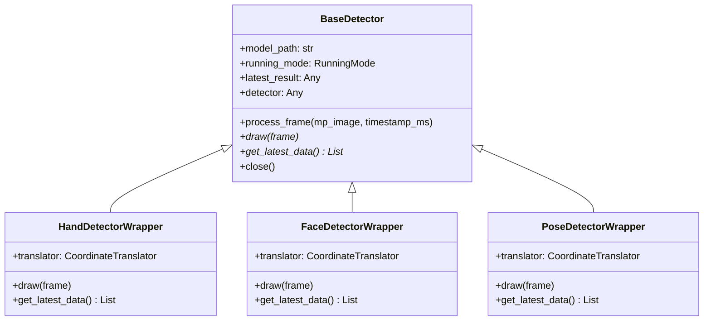

# Multi-Module Hand, Face, & Pose Tracker
A modular, high-performance computer vision application built on MediaPipe Tasks and OpenCV. The project features real-time tracking, biometric landmark extraction, and structure-based data access for hand, face, and pose modalities.
## 🚀 Getting Started
### Prerequisites
 * Python 3.9 - 3.11 (due to MediaPipe version dependencies)
 * A webcam or camera source (unless using video files)
### Installation
**1. Clone the project:**
```bash
git clone https://github.com/georgeAkonjom/Sight.git
cd Sight

```
**2. Create and activate a virtual environment:**
```bash
python -m venv venv
source venv/bin/activate

```
**3. Install dependencies:**
```bash
pip install -r requirements.txt

```
### Run Commands
Run the orchestrator using different flag configurations:
> **TIP:** If no tracking flags are specified, the orchestrator defaults to running **Hand Tracking** only, on camera 0.
> 
**Run Hand Tracking (Webcam 0)**
```bash
python main.py --hand

```
**Run all modules (Hand + Face + Pose) on Webcam 0**
```bash
python main.py --all

```
**Run Gesture & Body Language Recognition**
```bash
# This automatically enables all detectors (Hand, Face, Pose) and evaluates 90+ gestures / body language indicators
python main.py --gesture

```
**Run Gaze Tracking & Screen Calibration [BETA]**
```bash
# This automatically enables face tracking and initiates interactive 9-point calibration
python main.py --gaze

```
**How to perform the Gaze Calibration:**
 1. A **red dot** will appear on the window as the current calibration target (e.g., Target 1/9).
 2. Focus your eyes on the center of the red dot and press the **SPACE bar**. The window will capture 15 calibration frames (flashing a green square).
 3. The red dot will move to a new position. Repeat the process for all 9 points.
 4. Once calibration is complete, the regression model trains automatically, and a **green circle/crosshair** will track and display your real-time gaze look-point.
**Run Contactless Heart Rate Tracking [BETA]**
```bash
# This automatically enables face tracking and starts real-time rPPG analysis
python main.py --hr

```
**How it works:**
 1. The program tracks the forehead and cheeks, extracting mean color values to filter out sensor noise.
 2. The first 150 frames (~5 seconds at 30 FPS) are used to calibrate/fill the buffer (progress bar shown).
 3. Once full, the POS algorithm isolates the pulse signal, zero-padded FFT computes the heart rate, and peak detection determines the HRV (RMSSD).
 4. Renders a real-time biometrics overlay card in the top-left corner, including a scrolling PPG pulse waveform graph.
**Process a video file synchronously and save annotated output**
```bash
python main.py --all --input input_video.mp4 --mode video --output output_annotated.mp4

```
**Run in Headless Mode (CLI only, useful for servers)**
```bash
python main.py --all --headless

```
**Use a remote IP Webcam**
```bash
python main.py --hand --input "http://192.168.1.100:8080"

```
## The Idea
AI runs on two things: data and compute. Feed it better data and you get better results, especially when the goal is something that feels intuitive rather than mechanical. Sight and Thought are our take on that.
### "Sight": Our Multi-Modal Context Engine
Sight streams in video (hand, pose and face landmarks), audio (coming), text (coming), and tries to piece it all into something coherent. The idea is to carry more meaning with fewer bytes. The way you can clock someone's mood, guess their next move, and figure out how to approach them in a glance, is what we attempt to do with our models. Sight and Thought tries to predict what a person will say or do based on what's happening right now.
Thought for Speech is for people who don't read social situations easily. If you are neurodivergent or have a sensory processing disorder, the cues everyone else seems to pick up naturally can just vanish. Even more difficult is communicating to people these cues they seem to understand naturally. This makes them explicit, and shows you the movements to make to communicate at your best!
Thought for Disability treats movement as language. Sign language, Gestures, expressions, posture, all of it gets converted into speech for people who cannot rely on their voice. Not as words you type, but as something closer to how you already communicate.
## Planned Features & Future Implications
As the project continues to evolve, we are actively expanding our capabilities. Here is a look at what is on our roadmap:
### 1. "Thought": Our Predictive Modeling Suite
"Thought" represents our upcoming set of models designed for **contextual behavioral translation**. We plan to move beyond just tracking coordinates to actively interpreting them. This includes:
 * **Behavioral Anticipation:** Predicting what a person might do or say next based on a real-time fusion of hand gestures, facial micro-expressions, and body language.
 * **Advanced Translation:** Evolving "Thought for Disability" to fluidly translate continuous sign language and spatial gestures into natural speech and text.
 * **Social Cuing:** Refining "Thought for Speech" to act as a real-time social interpreter, explicitly highlighting emotional states and communication cues to bridge gaps in social intuition.
 * **Affective Computing (Valence & Arousal Mapping):** Fusing 52 facial blendshapes with real-time heart rate variability (HRV) metrics to map human emotion onto a continuous spectrum (e.g., distinguishing high-energy frustration from low-energy boredom).
 * **Intent-Driven Focus (Gaze-Gesture Fusion):** Combining the Gaze tracking module with Hand tracking to predict *what* object or screen element a user intends to interact with before their hand physically reaches it, drastically decreasing interaction latency.
### 2. Broader Sector Implications
By packaging rich, real-time biometric tracking into a lightweight architecture, Sight and Thought has deep implications across several fields:
 * **Sports:** Enabling real-time biomechanical analysis. By combining precise 3D world-coordinate pose tracking with contactless heart rate (rPPG) estimation, the system can aid in form correction, fatigue tracking, and injury prevention without forcing athletes to wear physical sensors.
 * **Security:** Moving beyond basic facial recognition to non-intrusive intent and anomaly detection. By analyzing gaze stability, micro-expressions, and deviations from baseline body language, systems can flag high-stress, deceptive, or erratic psychological states naturally.
 * **Disability:** Creating a world where physical interfaces adapt to the user rather than the other way around. Overlaying eye-gaze maps with custom gesture engines allows any voluntary, localized movement to become a fully valid, high-bandwidth input method for navigating technology.
 * **Model Training:** Providing a massive pipeline for generating structured, highly labeled, multi-modal human behavioral datasets. This high-fidelity fusion of vision telemetry, audio, and text is exactly the data foundation required to train the next generation of intuitive, "empathetic" AI models.
 * **Computer Vision:** Pushing the boundaries of edge computing by proving that real-time, multi-modal sensor fusion (Hand + Face + Pose + Gaze + Vitals) can be executed efficiently on consumer hardware with low latency, paving the way for more cohesive machine scene understanding.
 * **Ergonomics & Workplace Wellness:** Utilizing 3D metric world-coordinates from the Pose module to dynamically calculate joint angles (such as neck flexion and spine curvature) over time, actively protecting desk workers or industrial laborers from repetitive strain injuries (RSI).
 * **Human-Robot Interaction (HRI) & Digital Twins:** Translating localized pose and gesture streams into standardized spatial control vectors. This enables tracking telemetry to safely pilot robotic hardware, animate digital avatars, or drive spatial environments in AR/VR without requiring proprietary hardware suits.
 * **Retail & Consumer Behavior Analytics:** Tracking gaze dwell time, micro-expressions of interest or hesitation, and bodily posture engagement relative to a product or digital display to quantitatively measure engagement metrics entirely anonymously.
## Project Overview
The project can grab input video from webcams, files, or IP cameras and throws it at a bunch of MediaPipe landmarkers at the same time. It is built for real-time use, gesture detection, expression parsing, with the usual concerns about keeping things loosely coupled and fast enough to not lag behind a live feed.
**Plugin-based detector architecture**
Hand, Face, Pose all share a base class called BaseDetector. It defines the lifecycle for each frame:
 * **Initialization:** Loads model assets, picks sync or async.
 * **process_frame:** Runs inference in whichever mode you chose.
 * **draw:** Puts landmarks and connections on the frame using OpenCV.
 * **get_latest_data:** Hands back predictions as plain dicts or whatever Python structures make sense.
 * **close:** Tears down the task runners.
## Architectural Concepts
### Plugin-Based Detector Architecture
At the core of the codebase is a unified, extensible detector interface. All individual trackers (Hand, Face, Pose) inherit from the base class BaseDetector.
This base class defines a standard lifecycle for processing frames:
 * **Initialization:** Configures model assets and selects between synchronous and asynchronous operation modes.
 * **process_frame:** Coordinates inference requests based on the designated running mode.
 * **draw:** Superimposes annotated landmarks and connections onto the visual frame using OpenCV.
 * **get_latest_data:** Formats predictions into clean, serializable Python structures for downstream consumption.
 * **close:** Properly disposes of task runners.

### Dual-Mode Execution Model
The detectors support two execution profiles defined by MediaPipe's RunningMode:
 1. **LIVE_STREAM (Asynchronous):** Designed for webcams and interactive applications. Inference is dispatched asynchronously using detect_async without blocking the main OpenCV video loop. A dedicated callback function (_result_callback) handles incoming predictions from background worker threads, ensuring the UI remains highly responsive even when inference latency fluctuates.
 2. **VIDEO (Synchronous):** Designed for processing pre-recorded video files. Every frame is analyzed sequentially via detect_for_video using monotonic timestamps computed from the video's frame rate. This guarantees frame-by-frame analysis with zero dropped detections.
### Decoupled Rendering and Structured Data Retrieval
A critical design decision in this project is the total separation of visualization logic from data extraction.
 * **Drawing (draw):** Uses task-specific drawing_utils and custom styles to overlay lines and mesh points directly on OpenCV frames.
 * **Data Export (get_latest_data):** Extracts, normalizes, and packages tracking outputs (e.g. wrist location, iris positions, facial blendshapes, and pose world coordinates) into a standardized format. This allows other systems (such as ML models, games, or robotics scripts) to ingest the coordinates directly without relying on OpenCV visualizations.
## Module Details & Capabilities
### 1. Hand Tracking Module
The HandDetectorWrapper class manages hand landmarking operations:
 * **Multi-Hand Tracking:** Configured to track up to two hands simultaneously.
 * **Handedness Mapping:** Corrects and outputs the structural handedness (Left vs Right) by reversing MediaPipe's default classification to compensate for the mirrored webcam feed.
 * **Error Protection:** Features out-of-bounds guards in callback processing to prevent application crashes when handedness data fails to sync with landmark arrays.
 * **Landmark Coordinates:** Tracks the 3D position (x, y, z) of all 21 key hand joints.
### 2. Face Tracking Module
The FaceDetectorWrapper class performs dense facial geometry tracking:
 * **Tessellation & Contours:** Draws high-fidelity face meshes including face contours, lip outlines, eye shapes, and eyebrow segments.
 * **Iris Tracking:** Real-time rendering of Left and Right iris landmarks for eye-gaze and eye-tracking applications.
 * **52 Blendshapes:** Extracts standard facial expression categories (e.g. brow lowering, jaw open, eye blink, mouth stretch) with floating-point confidence scores [0.0, 1.0].
 * **Facial Transformation Matrix:** Exports a rigid transformation matrix representing the 3D head pose (rotation and translation) relative to the camera space.
### 3. Pose Tracking Module
The PoseDetectorWrapper class tracks full-body skeletons:
 * **33 Pose Landmarks:** Draws body joints, shoulder-hip connections, and limbs.
 * **World Coordinates:** In addition to normalized screen-space landmarks, it extracts world_landmarks in a 3D metric space (measured in meters, origin centered around the hips), enabling accurate physical distance and motion calculations.
 * **Fail-Safe Loading:** Includes initialization try-catch blocks to prevent crashes if the heavy pose-estimation model fails to load.
### 4. Coordinate Translation Helper
The helper class CoordinateTranslator handles landmark formatting:
 * Converts MediaPipe's native object representations into serializable Python dictionaries ({"x": float, "y": float, "z": float}).
 * Unifies coordinate handling across all wrappers to ensure code reusability.
### 5. Gesture Recognition Engine
The gesture recognition package enables real-time high-level biometric evaluation:
 * **CLI Flag --gesture:** Automatically enables all necessary tracking modules (Hand, Face, Pose) and evaluates 120+ unique hand gestures, pose postures, and stateful body language signals.
 * **Biometric Calibration:** Initiates a stateful 10-second baseline calibration upon start to establish neutral expression and posture baselines.
 * **Micro-expression Detection:** Identifies subtle cues like smirks, squints, raised/skeptical eyebrows, parted lips, and tongue protrusions relative to user baselines.
 * **Pupil & Gaze Stability:** Tracks gaze stability invariant to head rotation, detecting shifty gaze, irregular blinking, and rapid eye movements (saccades).
### 6. Gaze Tracking Module [BETA]
The helper class GazeTracker enables 3D head pose and gaze vector projection:
 * **CLI Flag --gaze:** Automatically enables the Face tracking module and starts interactive calibration.
 * **PnP Head Pose:** Solves the Perspective-n-Point (PnP) problem using key 3D canonical face coordinates and 2D landmarks via OpenCV to determine real-time head yaw, pitch, and roll. Projects 3D coordinate axes directly on the user's nose.
 * **Pupil Offset Integration:** Tracks relative iris positions normalized by eye corner distance for rotation-invariant gaze offsets.
 * **9-Point Linear Regression Calibration:** Solves a least-squares polynomial regression to map composite head-pose and pupil offsets directly to screen pixel coordinates. Uses a 9-point screen target grid.
 * **EMA Smoothing:** Applies a low-pass exponential moving average filter to screen gaze coordinates to eliminate jitter.
### 7. Contactless Heart Rate Module [BETA]
The helper class HeartRateTracker performs remote photoplethysmography (rPPG):
 * **CLI Flag --hr:** Automatically enables the Face tracking module and starts real-time pulse and HRV estimation.
 * **ROI Extraction:** Tracks forehead and left/right cheek regions dynamically scaled to the user's face dimensions.
 * **POS Algorithm:** Implements the Plane-Orthogonal-to-Skin (POS) algorithm to extract the Blood Volume Pulse (BVP) signal while minimizing movement and illumination noise.
 * **FFT Ideal Filter:** Applies a zero-latency ideal bandpass filter using FFT/IFFT between 0.75 Hz and 3.0 Hz (45 to 180 bpm).
 * **Interpolated Peak Frequency:** Zero-pads BVP signals to 2048 samples prior to FFT, yielding highly precise heart rate estimation.
 * **Heart Rate Variability (HRV):** Performs discrete peak detection to compute successive Inter-Beat Intervals (IBIs) and outputs the Root Mean Square of Successive Differences (RMSSD) metric in milliseconds.
 * **Scrolling Waveform Graph:** Renders a custom-drawn moving photoplethysmogram (PPG) graph directly onto the OpenCV window interface.
## Command Line Orchestrator
**Dynamic Module Activation** Enables individual activation or concurrent tracking of multiple modalities via CLI flags:
| Flag | Description |
|---|---|
| --hand | Enable Hand tracking. |
| --face | Enable Face mesh, blendshapes, and head pose tracking. |
| --pose | Enable Pose skeletal and metric world landmarks tracking. |
| --all | Activate all base trackers (Hand + Face + Pose) simultaneously. |
| --gesture | Activate the gesture and body language classification engine. |
| --gaze **[BETA]** | Activate 3D gaze estimation and interactive 9-point screen calibration. |
| --hr **[BETA]** | Activate contactless rPPG heart rate & HRV (RMSSD) estimation. |
**Flexibility in Inputs** Accepts local webcam IDs, pre-recorded video files, or remote streaming sources (RTSP, RTMP, HTTP).
**Auto-casting & Normalization** * Auto-casts digit strings (e.g. --input "0") to integers for OpenCV video capture device mapping.
 * Automatically appends /video to raw IP webcam streams (e.g., from mobile IP camera apps) to simplify endpoint URLs.
**Low-Latency Streaming** Forces OpenCV frame buffering size to 1 (CAP_PROP_BUFFERSIZE = 1) during live streams, preventing lag build-up and ensuring real-time frame analysis.
**Output Recording** Offers optional video recording (--output) to save annotated frames directly to a file.
**Headless Mode** Supports running without visual window rendering (--headless) for background data collection.
