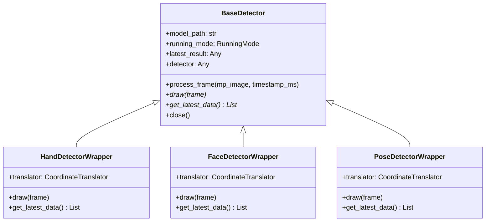

# Multi-Module Hand, Face, & Pose Tracker

A modular, high-performance computer vision application built on MediaPipe Tasks and OpenCV. The project features real-time tracking, biometric landmark extraction, and structure-based data access for hand, face, and pose modalities.

## The Idea

Artificial intelligence is limited by data and processing power. Modifying the kind of data we feed to AI is a crucial step forward in optimizing **its overall efficiency and capacity for human-like intuition.**

Sight and thought, are our attempt at the problem we identified above. Sight collects and synthesizes data from multiple sources, video(hand, pose and face landmarkers), auditory(pending) and textual data, and pieces it all together. This multi-modal structure allows us to carry a lot more meaning in a lot less data, in the same way humans can tell a persons mood(cheery, upset, etc), infer what a person might do and how best to approach and interact with them from just a glance, sight and thought attempts to ma1ke predictions on a persons behavior, what they might say or even do, based on the what they are doing, saying and the way they are behaving currently.

Thought for Disability **provides a crucial assistive tool for neurodivergent individuals or those with sensory processing disorders, offering real-time translations of complex social interactions and subtle emotional cues that might otherwise be missed**, alongside real-time sign language translation for ...

Thought for speech **empowers those with vocal impairments by converting their expressive gestures, facial landmarks, and distinct body language into fluent, highly contextualized communication.**

Thought takes the synthesized output from sight and looks in over in 2 second blocks, comparing inference from each block to keep context, and returns an abstraction in natural language that describes the scene, mood and body language, of the identified speaker, alongside a natural language summary of all they have said so far. You may prompt it to go into tutor mode, where it shows you poses to take in real time based on what you are currently saying, and corrects on **your physical delivery, offering feedback on how to adjust your posture, eye contact, and hand movements so your non-verbal communication perfectly matches your intended message.**
## Project Overview

The project provides a flexible infrastructure to capture video streams (from local webcams, video files, or remote IP camera streams) and process them using multiple Google MediaPipe task landmarkers concurrently. The architecture is designed to support real-time user-interface interaction, gesture detection, and expression parsing, while maintaining clean separation of concerns and low-latency frame pacing.

---

## Architectural Concepts

### Plugin-Based Detector Architecture
At the core of the codebase is a unified, extensible detector interface. All individual trackers (Hand, Face, Pose) inherit from the base class [BaseDetector](file:///home/sammm/Work/Sight/detectors/base_detector.py#L3). 

This base class defines a standard lifecycle for processing frames:
- **Initialization**: Configures model assets and selects between synchronous and asynchronous operation modes.
- **`process_frame`**: Coordinates inference requests based on the designated running mode.
- **`draw`**: Superimposes annotated landmarks and connections onto the visual frame using OpenCV.
- **`get_latest_data`**: Formats predictions into clean, serializable Python structures for downstream consumption.
- **`close`**: Properly disposes of task runners.



### Dual-Mode Execution Model
The detectors support two execution profiles defined by MediaPipe's `RunningMode`:

1. **`LIVE_STREAM` (Asynchronous)**:
   Designed for webcams and interactive applications. Inference is dispatched asynchronously using `detect_async` without blocking the main OpenCV video loop. A dedicated callback function (`_result_callback`) handles incoming predictions from background worker threads, ensuring the UI remains highly responsive even when inference latency fluctuates.
2. **`VIDEO` (Synchronous)**:
   Designed for processing pre-recorded video files. Every frame is analyzed sequentially via `detect_for_video` using monotonic timestamps computed from the video's frame rate. This guarantees frame-by-frame analysis with zero dropped detections.

### Decoupled Rendering and Structured Data Retrieval
A critical design decision in this project is the total separation of visualization logic from data extraction. 
- **Drawing (`draw`)**: Uses task-specific `drawing_utils` and custom styles to overlay lines and mesh points directly on OpenCV frames.
- **Data Export (`get_latest_data`)**: Extracts, normalizes, and packages tracking outputs (e.g. wrist location, iris positions, facial blendshapes, and pose world coordinates) into a standardized format. This allows other systems (such as ML models, games, or robotics scripts) to ingest the coordinates directly without relying on OpenCV visualizations.

---

## Module Details & Capabilities

### 1. Hand Tracking Module
The [HandDetectorWrapper](file:///home/sammm/Work/Sight/detectors/hand/hand_detector.py#L8) class manages hand landmarking operations:
- **Multi-Hand Tracking**: Configured to track up to two hands simultaneously.
- **Handedness Mapping**: Corrects and outputs the structural handedness (`Left` vs `Right`) by reversing MediaPipe's default classification to compensate for the mirrored webcam feed.
- **Error Protection**: Features out-of-bounds guards in callback processing to prevent application crashes when handedness data fails to sync with landmark arrays.
- **Landmark Coordinates**: Tracks the 3D position (x, y, z) of all 21 key hand joints.

### 2. Face Tracking Module
The [FaceDetectorWrapper](file:///home/sammm/Work/Sight/detectors/face/face_detector.py#L8) class performs dense facial geometry tracking:
- **Tessellation & Contours**: Draws high-fidelity face meshes including face contours, lip outlines, eye shapes, and eyebrow segments.
- **Iris Tracking**: Real-time rendering of Left and Right iris landmarks for eye-gaze and eye-tracking applications.
- **52 Blendshapes**: Extracts standard facial expression categories (e.g. brow lowering, jaw open, eye blink, mouth stretch) with floating-point confidence scores [0.0, 1.0].
- **Facial Transformation Matrix**: Exports a rigid transformation matrix representing the 3D head pose (rotation and translation) relative to the camera space.

### 3. Pose Tracking Module
The [PoseDetectorWrapper](file:///home/sammm/Work/Sight/detectors/pose/pose_detector.py#L7) class tracks full-body skeletons:
- **33 Pose Landmarks**: Draws body joints, shoulder-hip connections, and limbs.
- **World Coordinates**: In addition to normalized screen-space landmarks, it extracts `world_landmarks` in a 3D metric space (measured in meters, origin centered around the hips), enabling accurate physical distance and motion calculations.
- **Fail-Safe Loading**: Includes initialization try-catch blocks to prevent crashes if the heavy pose-estimation model fails to load.

### 4. Coordinate Translation Helper
The helper class [CoordinateTranslator](file:///home/sammm/Work/Sight/helpers/coordinate_translator.py#L3) handles landmark formatting:
- Converts MediaPipe's native object representations into serializable Python dictionaries (`{"x": float, "y": float, "z": float}`).
- Unifies coordinate handling across all wrappers to ensure code reusability.

### 5. Gesture Recognition Engine
The gesture recognition package ([gesture_recognition/](file:///home/sammm/Work/Sight/gesture_recognition/)) enables real-time high-level biometric evaluation:
- **CLI Flag `--gesture`**: Automatically enables all necessary tracking modules (Hand, Face, Pose) and evaluates 120+ unique hand gestures, pose postures, and stateful body language signals.
- **Biometric Calibration**: Initiates a stateful 10-second baseline calibration upon start to establish neutral expression and posture baselines.
- **Micro-expression Detection**: Identifies subtle cues like smirks, squints, raised/skeptical eyebrows, parted lips, and tongue protrusions relative to user baselines.
- **Pupil & Gaze Stability**: Tracks gaze stability invariant to head rotation, detecting shifty gaze, irregular blinking, and rapid eye movements (saccades).

---

## Command Line Orchestrator

The main entry point, [main.py](file:///home/sammm/Work/Sight/main.py), handles resource orchestration and program options:

- **Dynamic Module Activation**: Enables individual activation or concurrent tracking of multiple modalities (e.g. Hand + Face + Pose) via CLI arguments.
- **Flexibility in Inputs**: Accepts local webcam IDs, pre-recorded video files, or remote streaming sources (RTSP, RTMP, HTTP).
- **Auto-casting & Normalization**:
  - Auto-casts digit strings (e.g. `--input "0"`) to integers for OpenCV video capture device mapping.
  - Automatically appends `/video` to raw IP webcam streams (e.g., from mobile IP camera apps) to simplify endpoint URLs.
- **Low-Latency Streaming**: Forces OpenCV frame buffering size to 1 (`CAP_PROP_BUFFERSIZE = 1`) during live streams, preventing lag build-up and ensuring real-time frame analysis.
- **Output Recording**: Offers optional video recording (`--output`) to save annotated frames directly to a file.
- **Headless Mode**: Supports running without visual window rendering (`--headless`) for background data collection.

---

## Directory Structure

```
.
├── detectors/
│   ├── base_detector.py                 # Common tracking abstract class
│   ├── face/
│   │   ├── __init__.py
│   │   └── face_detector.py             # FaceMesh, Blendshape & HeadPose Wrapper
│   ├── hand/
│   │   ├── __init__.py
│   │   └── hand_detector.py             # HandLandmarker & Handedness Wrapper
│   └── pose/
│       ├── __init__.py
│       └── pose_detector.py             # Pose Landmark & World Coordinate Wrapper
├── gesture_recognition/                 # Gesture Recognition Engine (NEW)
│   ├── __init__.py                      # Package entrypoint
│   ├── utils.py                         # 3D Math and finger-state heuristics
│   ├── hand_gestures.py                 # 60 hand gestures & ASL sign detectors
│   ├── pose_gestures.py                 # 30 pose/skeleton posture detectors
│   ├── body_language.py                 # Expression and shrug detectors
│   ├── evaluator.py                     # Unified data aggregator & evaluator
│   └── test_gestures.py                 # Mock test suite
├── helpers/
│   └── coordinate_translator.py         # Standardizes MediaPipe outputs to dicts
├── models/
│   ├── face_landmarker.task             # MediaPipe Face Landmarker binary asset
│   ├── hand_landmarker.task             # MediaPipe Hand Landmarker binary asset
│   └── pose_landmarker.task             # MediaPipe Pose Landmarker binary asset
├── main.py                              # Main Orchestrator & CLI program
├── requirements.txt                     # Project dependencies
└── README.md                            # Concept notes & usage documentation
```

---

## 🚀 Getting Started

### Prerequisites
- Python 3.9 - 3.11 (due to MediaPipe version dependencies)
- A webcam or camera source (unless using video files)

### Installation

1. Clone the project:
   ```bash
   git clone https://github.com/georgeAkonjom/Sight.git
   cd Sight
   ```

2. Create and activate a virtual environment:
   ```bash
   python -m venv venv
   source venv/bin/activate
   ```

3. Install dependencies:
   ```bash
   pip install -r requirements.txt
   ```

### Run Commands

Run the orchestrator using different flag configurations:

> [!TIP]
> If no tracking flags are specified, the orchestrator defaults to running **Hand Tracking** only, on camera `0`.

- **Run Hand Tracking (Webcam 0)**:
  ```bash
  python main.py --hand
  ```

- **Run all modules (Hand + Face + Pose) on Webcam 0**:
  ```bash
  python main.py --all
  ```

- **Run Gesture & Body Language Recognition**:
  ```bash
  # This automatically enables all detectors (Hand, Face, Pose) and evaluates 90+ gestures / body language indicators
  python main.py --gesture
  ```

- **Process a video file synchronously and save annotated output**:
  ```bash
  python main.py --all --input input_video.mp4 --mode video --output output_annotated.mp4
  ```

- **Run in Headless Mode (CLI only, useful for servers)**:
  ```bash
  python main.py --all --headless
  ```

- **Use a remote IP Webcam**:
  ```bash
  python main.py --hand --input "http://192.168.1.100:8080"
  ```
